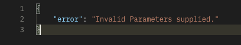
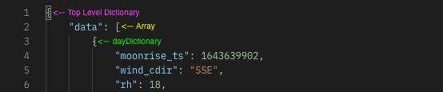
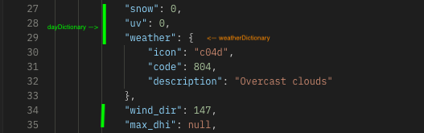

# Forecast
In this project, you will use your knowledge of Swift and Networking to build an app that displays the current weather and a 16 day forecast for a specific city!

Students who complete this project independently or as a pairing will showcase their understanding of the following principles:

* Basic Storyboard constraints
* UITableviews
* Creating Custom `class` objects
* Constants, Variables, and Basic Data Types
* Collections
* Functions
* Control Flow
* IBActions && IBOutlets
* API Calls
* API Documentation


---

##  Before you begin
Please `Fork` then `clone` the repo. You can access the repo here:
[GitHub - Stateful-Academy/Forecast: A networking app that will display a rolling 7-day forecast. Best used when deciding when to play golf!](https://github.com/Stateful-Academy/Forecast)

Create a local branch named `starter` and track the remote branch `starter`. 

To do this:
 * Open `Terminal`
 * Navigate to the correct `directory`
 * Type `git checkout --track origin/starter` 
	 * Hype


---

## Design
If you build and run the app now that you are on the `starter` branch you will discover that we’ve created the UI for this project for you. We made this decision to allow you to focus on the networking code required. Take a moment and explore the project and how the Interface is set up. Some items to be on the lookout for are:
*  Are all the files `subclassed` properly?
* Are all the `IBOutlets` connected properly?
* How is that `tableView` on a `ViewController`?

Warning: There are some setup steps that we’ve intentionally left undone which the instructions will not inform you how to fix. Though, you cannot fix them at this time.

___

## API Docs
When you are building an app that will display data from an API; that API will determine the properties of your model. Before you ever create the file for your `Model` You need to familiarize yourself with the documentation provided. 

The API we will be using for today's project is provided by WeatherBit.io. You can access the documentation via this link:
[Weatherbit | Weather API Documentation](https://www.weatherbit.io/api)

You need to read and complete the `How do I get access`  section. The free plan will be perfect for our needs so please DO NOT enter any payment information. Once you have successfully created your account and received your `API Key` please review the documentation for the specific `endpoint` we will be hitting for today's project. 

[Weatherbit | 16 Day Forecast API Documentation](https://www.weatherbit.io/api/weather-forecast-16-day)
This page has some very good and very important information for you as a developer. It will explain what the `Base URL` will be, ( *oh, you thought base URL was a Stateful term? Nah fam.* ) what `parameters` and `Query Items` you will need for the URL.  

This documentation even has an example URL you can compare your `finalURL` to.

Along with an example of the response, you should get back. We are real fans of the last section, `Field Decriptions`, as it provides a key to what the shorthand means.

As an aside.. shouldn’t it be `Field Decryptions`? 🤔

---

## Testing the URL in Postman
Within the application Postman, make a new request. 
* Add only the `BaseURL`  in the field that is to the right of `GET`.

We want to build our URL piece by piece in `Postman`. The steps to creating a working request in `Postman` will be very similar to the steps you will soon take within Xcode. 

1. Under the `Query Params` add a new key with the key `key`.
	1. I know that confusing to read.. but for this API the keyValue for your APIKey is the word `key`….
2. Under the `Query Params` add a new value to the `key` you just created. The `value` you will add is the `value` for your APIKey.
	1. This should be that crazy long set of characters you got with your account.
	2. I know this is also a challenge to read.. but these are the proper terms to be using.
Congratulations! You just added your first `Query Parameter` to Postman! Press the send button and see what results you get!



Read the documentation to see what other `Query Parameters`  are not optional for the URL. 

---

### Completing the URL on Postman

As I’m sure you just discovered, the best `Query Parameter`  to use is longitude and latitude. That is not common knowledge. Let’s use the `City Name` parameter instead.

1. Under the `Query Params` add a new key with the key `city`.
2. Under the `Query Params` add a  new value to the `key` you just created. The `value` you will add is whatever city you want to see the weather for.
3. A few quick options you can use are:
	1. Las Vegas
	2. Salt Lake
	3. Boulder

Reading through the results you’ll discover that you are now receiving `16` days worth of forecast data, which is the default amount to return.
( can you change that limit? )

You’ll also discover that the weather units are all displayed in `Celsius`. I don’t know about you, but some grumpy bois didn’t throw a bunch of tea into the sea for me to be writing an app that uses `Celsius`. This is an optional parameter - but if you wish you can change it to `Imperial`.

For the fun of it
* Under the `Query Params` add a new key with the key `units`.
* Under the `Query Params` add a  new value to the `key` you just created. The `value` you will add is `I`

Send the request again you’ll now have a `MERICA`fied result of data. Use this `Final URL` as an example for when you write your `URL` in Xcode.

---

### Reading the data on Postman
Take a few moments and explore the `nesting`  and structure of the JSON data you will receive from the request you just completed. On the line numbers, there are arrows that will allow you to collapse the structures. I recommend pressing the arrow on line 2.

Some important notes are:
 1. We have a top-level dictionary that is a dictionary of type String and Any Object
	1. [String:Any]
1. There are a few keys available within the `Top-Level Dictionary`
	1. On the key `”data"` we have a value of an `array` of `String:Any` dictionaries.
	2. One the key `city_name` we have a value of the city name for the results.
	
Now re-open the collapsed section from line 2. This will allow us to see the values with the `String and Any` dictions in the `data` array. Some Important notes are:
1. This level holds the majority of the data we wish to display
2. To display `icon`s we need to access a dictionary of type `String` and `Any` with the key `”weather”`. 
	1. Hint: Remember this when building your `Model`

Awesome! You should now be somewhat comfortable with the data that will be returned from the `endpoint` we aim to use.

Take a break and then we will get to writing some code!

---

## Model
* Create a new `.Swift` file with the name `Day`.
* Create a new class named `Day`
* Add the following parameters:
	1. cityName
	2. temp
	3. highTemp
	4. lowTemp
	5. description
	6. iconString
	7. validDate

Review the API Docs and Postman to determine what values these `constants` should have.

___

### Fail able Initializer

Our goal is to create the model `Day` objects using the values received from a network call. With that in mind, think through what could go wrong. 

The user could lose network access; the API could be down; you could receive a bad request… The list goes on. The opportunity for something to `fail` is too great to create our objects using the traditional member-wise initializer. This is why we create an initializer that can `fail` gracefully. 

If for some reason you cannot initialize a value for some reason it will not complete the initialization and return a `nil` value, rather than crashing the app.

To build our Fail-able Initializer on the `Day` class file, we need to:
1. Declare an init with a `?`
	1. `init?` - this is what allows it to fail.
2. Give this `fail able member-wise initializer` two parameters
	1. A `dayDictionary` of type `String` `Any`
	2. A `cityName` of type `String`

Within the body of this  `fail able member-wise initializer,` we will `parse`, or navigate to the values we need. 

Remember - all the data we want is locked in little `Collection` boxes. All we need to do is open them one step at a time. For the sake of this project let’s assume that we will pass in the `[String:Any]` dictionary that is housed in the `Array of Dictionaries - [[String:Any]]` that is accessible via the `”data”` key.

**Pause** - if that didn’t make sense take a moment to review the lines above with the data you get back on Postman.

This is the `dayDictionary` we are passing into our `fail able` initializer:



Okay, back to coding. To parse the values properly we will need to `quard` that we can `optionally typecast` the values as the types we expect. Have all of the following under the same `guard` statement.
1. `guard let temp` and using Subscript Syntax from the `dayDictionary` assign the value of the key `”temp”`
	1. Optionally typecast this as a `Double`
2. Create a constant named `highTemp` and using Subscript Syntax from the `dayDictionary` assign the value using the proper key.
	1. Optionally type cast this as a `Double`
3. Create a constant named `lowTemp` and using Subscript Syntax from the `dayDictionary` assign the value using the proper key.
	1. Optionally typecast this as a `Double`
4. Create a constant named `validData` and using Subscript Syntax from the `dayDictionary` assign the value using the proper key.
	1. Optionally type cast this as a `Double`

Now, for the remaining properties, we need to parse down one more level to the `”weather” dictionary of type [String:Any]` This is where our `icon` and `description` values are housed.



4. Create a constant named `weatherDict` and using Subscript Syntax from the `dayDictionary` assign the value using the key `”weather"`.
	1. Optionally typecast this as a `[String:Any]`
5. 4. Create a constant named `description` and using Subscript Syntax from the `weatherDict` assign the value using the proper key.
	1. Optionally typecast this as a `String`
6. 4. Create a constant named `iconString` and using Subscript Syntax from the `weatherDict` assign the value using the proper key.
	1. Optionally typecast this as a `String`
7. Finally, you can finish the `guard` you began above by `else {return nil}`
8. Now set these new properties to the properties on `self`

Great work! The model is now complete. Build, run, commit, and take a break.

``` swift
class Day {
    
    let cityName: String
    let temp: Double
    let highTemp: Double
    let lowTemp: Double
    let description: String
    let iconString: String
    let validDate: String
 
    init?(dayDictionary:[String:Any], cityName: String ) {
        
        guard let temp = dayDictionary["temp"] as? Double,
        let highTemp = dayDictionary["high_temp"] as? Double,
        let lowTemp = dayDictionary["low_temp"] as? Double,
        let validData = dayDictionary["valid_date"] as? String,
        // We need to parse one additional level for the remaining values
        let weatherDict = dayDictionary["weather"] as? [String:Any],
        // Now we have access to the remaining values
        let description = weatherDict["description"] as? String,
        let iconString = weatherDict["icon"] as? String else {return nil}
        
        self.temp = temp
        self.highTemp = highTemp
        self.lowTemp = lowTemp
        self.validDate = validData
        self.description = description
        self.iconString = iconString
        self.cityName = cityName
    }
}

```

___


## Model Controller
Create the `Model Controller` file and `class`.

Take a moment and reflect on the purpose of a `Model Controller` and what we need for this project. Typically, a `Model Controller` will house the `CRUD` functions. A ` Source of Truth`, a `Singleton`, if necessary, and other important `Helper` functions. 

Let’s go through each of these one at a time and see how they will work with this `Networking` app.

___

### CRUD
1. Create
	1. Ask yourself *how* the `Day` objects will be created. Are they created manually for a user? Or do we fetch the data from an API?
	2. Declare a method signature named `fetchDays`
		1. Mark this as a `static` function.
2. Read
	1. To showcase the different types of `Data` you can use in a `closure` we will NOT be using a `Source of Truth` at this time.
3. Update
	1. I don’t think so…
4. Delete
	1. I don’t think so… 

___

### Source of Truth
1. Don’t need it. We will create a `closure` on our `fetchDays` function that will complete with an array of `Day` objects. 
	1. We will walk through how to do this at a later step

___

### Singleton
Take a moment and reflect on what a `Singleton` is and when you need one. A Singleton allows you to restrict the initialization of a single class to happen only once. This ensures that the properties, and collections, are always the same set of data. 

When you are pulling the data from an API , every time the data is `fetched` it will replace whatever is in the `Source of Truth`. This ensures the data is already correct without the need of a `Singleton`. If you were to use a `Singleton` for a project like this it would be `Singleton Abuse`.

We will need a `Source of Truth` . Thusly we have no need for a `Singleton`

___

### Helper Functions
All we really need to accomplish the goals of this app is  `fetch` the data from the API. At this time no additional functions are required. 

___

### Complete the Fetch Function
Within the `fetchDays` function we have a few goals: 

1. First, we need to decide what we want the `fetch` function to complete. Because this function will be responsible for hitting an `API Endpoint`, we know it will need a completion handler. 
2. Then, we need to piece together our URL. 
3. Once we have a `finalURL` we will pass that into the `dataTask(with: _, completion: )` function. This will `complete` with a `response` and either an `error` or `data`. 
4. If we are successful in retrieving data from the `dataTask` we will then need to decode that `data` into our objects. 
5. Once we have our objects we can add them to the `source` of truth.

With our goals laid out let’s start building this piece by piece.

___

#### Completion - Fetch
When deciding what your closures should complete you should consider *how* you want to use the data. Do you want to have a single object available with the task is done? Maybe you want an `array` of objects instead… Would you rather not have any objects, but just a `Bool` that tells you where it worked or not? Each has their merits. 

For this project, we have decided it would be best to complete with an `Optional` `Array` of `Day` objects. This will complete with a valid `[Day]` if everything worked.

* Modify your `fetchDays` function to have one parameter named `completion` that is marked as `@escaping` and takes in a `Optional Array of Day Objects` value and  `return`  Void.

<details>
<summary>How do I write this?</summary>
<br>
static func fetchDays(completion: @escaping ([Day]?) -> Void)
<br>	
</details>

Nice work! Let’s move on to the URL

---

#### URL Finalized

Here is what the `finalURL` will look like once it's fully built. 
`https://api.weatherbit.io/v2.0/forecast/daily?key=YOURKEY&city=YOURCITY` 
Reference back to this while building the smaller pieces.

* Create a `private` and `static` property `above` the declaration of the `fetchdays` function. This property will not change and should be named `baseURLString`. 
* Assign the value of the most consistent aspect of the URL as described on the API documentation.

Now, let’s navigate to inside the body of the `fetchDays(completion: [Day]?)`. To create your `finalURL` we will need to perform the following tasks:

* guard that you can initialize a new URL  named `baseURL`from the `baseURLSTring`
	* else { return }
* Create a new variable named `urlComponents`  and assign the value of a `URLComponents` initialized with a url that also is resolving against the BaseURL.

<details>
<summary>How do I write this?</summary>
<br>
var urlComponents = URLComponents(url: baseURL, resolvingAgainstBaseURL: true)
<br>	
</details>

* Create a new variable named `apiQuery`  and assign the value of a `URLQueryItem` initialized with a name - `”key"`” and a value - `“Whatever your api Keys value is”`
*  Create a new variable named `cityQuery`  and assign the value of a `URLQueryItem` initialized with a name - `”city"`” and a value - `“Whatever city you want the weather of”`
*  Create a new variable named `unitsQuery`  and assign the value of a `URLQueryItem` initialized with a name - `”units"`” and a value - `“I”`
* Call the `urlComponents` you initialized earlier
	* Using `dot Notation` access the `queryItems` property and assign the value of a default array that holds the `URLQueryItem`s you just initialized.
* Guard that you can create a constant named `finalURL` from the optional  `url` property on the `urlComponents`
	* else {return}
* Print out the `finalURL` for testing

Build and run. Commit, and take a 15 min break! We are now 1/3 of the way complete with our `fetchDays(completion: ([Day]?)-> Void)`

<details>
<summary>How do I write this?</summary>
<br>
var urlComponents = URLComponents(url: dailyURL, resolvingAgainstBaseURL: true)
<br>
let apiQuery = URLQueryItem(name: “key”, value: “YOUR KEYS VALUE”)
<br>
let cityQuery = URLQueryItem(name: “city”, value:”THE CITY YOU WANT”)
<br>
let unitsQuery = URLQueryItem(name: “units”, value: “I”)
<br>
urlComponents?.queryItems = [apiQuery,cityQuery,unitsQuery]
<br>
print(finalURL)
<br>	
</details>

---

#### DataTasking

Under the creation of the `finalURL` we will perform a `dataTask` that will  `complete` with a `response` and either an `error` or `data`. If we are successful in retrieving data from the `dataTask` we will then need to decode that `data` into our objects. Once we have our objects we can add them to the `source` of truth. To accomplish this we need to:

* call the `dataTask(with: URL, completionHandler: (Data?, URLResponse?, Error?) -> Void)` from the `shared` singleton on the `URLSession` class
	* pass in the `finalURL`
	* press `enter` on the autocompleteable aspect of the closure.
		* ( I made that name up, ¯\_(ツ)_/¯ )
	* Immediately head to the closing brace of this method and call `.resume()`
		* The program will not run without this line
	* name each item
		* dayData
		* _
		* error
	* conditionally unwrap an `error`
		* If `true` 
			* print `”"There was an error fetching the data. The url is \(finalURL), the error is \(error.localizedDescription)”`
			* completion(nil)
	* We are going to ignore the `response`
	* guard you can create `data` from `dayData`
		* else 
		* print `"There was an error recieveing the data!"`
			* completion(nil)
			* return
	
Okay, this next section will be the most challenging aspect of your Paired Programming Project.
* Declare a Do -> Try -> Catch block
* Within the body of the `do`
	* `if let` a new constant named `topLevelDictionary`
	* assign the value of `try` ing to create a `JSONObject` with the `data` you unwrapped above. This should allow some fragments,  and be `optionally Type Cast` as a Dictionary that holds String keys and any values.
		* `[String:String]`

Within the `true` body of the `if let` you just created we need to extract data from the `topLevelDictionarys` 

* Create a constant named `cityName` and using Subscript Syntax from the `topLevelDictionary` assign the value using the key `”city_name"`.
	1. FORCE  cast this as`!` a `string`
* Create a constant named `dataArray` and using Subscript Syntax from the `topLevelDictionary` assign the value using the key `”data"`.
	1. FORCE  cast this as`!` a `[[String:Any]]`

___

The `dataAarray` you just created is the array we need to loop through in order to get access to the individual dictionary within. Once we have access to those individual dictionaries we will be creating our `Day` objects. We need a temporary place to store the `Day` objects while we are creating them..

* Create a new variable named `tempDayArray` that is of type an array of `Day` objects with a value of an empty array.

* for `dayDictionary` in `dataArray`
	* `guard let` you can create a constant named `day` and assign the value of a `Day` object using the failable initializer you created on the `Day` Model file.
		* {else return}
	* Append this new `day` to the `tempDayArray`
* Outside the scope of the `for - in` you just created call your completion and complete with the `tempDayArray`

* After the closing brace of the `do`  
	*  `catch`
		*  print `”Error in Do/Try/Catch: \(error.localizedDescription)”`
		* call the completion as nil

Take a well-deserved sigh of relief. We did it! We have now completed the networking code required to hit the `API Endpoint` and parse the data to create our `Coin` objects! Well done.

* A - Always
* B - Be
* C - Committing

Build. Run. Commit. Party

---

## Wire Up the views
You have two `View` files you’ll need to complete. One is for the `DayDetailsViewController` and one is for the `DayForcastTableViewCell`. We feel that you should be getting more and more comfortable with the step of wiring up the views so the instructions for this will be light

### DayForcastTableViewCell

Create a `updateView` function with a parameter of type `Day` and set the value of the two `Label`s and single `imgeView` accordingly.
* Valid Data
* High temp - handle the error
* Create an image from the `day.imageString`

### DayDetailsTableViewController
* Create a local property named `days` and assign the value of empty array
	* Based on the name, what type should this be?
* Create a helper function called `updateViews`
* In the `viewDidLoad`
	* call the `fetchDays` function
	* press `enter` on the `autocompleteable` aspect of the closure.
		* ( I made that name up, ¯\_(ツ)_/¯ )
	* replace the `[Day]?` with the word `tempDays`
	* guard you can create a constant named `days` from the value of `tempDays`
	* set the local property `days` to the `days` you just unwrapped
	* On the main thread
		* call the `updateViews`  helper function
		* reload the data of the `dayForcastTableView`
* In the `updateViews`
	* Retrieve the first `day` in the `days` array
		* Set the properties of the Labels accordingly
			* Handle the type-mismatches
* set the number of rows
* complete the `cellForRow(at:)` function
	* Retrieve the `day` that matches
	* call the `updateView` function on cell and pass in the day

___

Victory? At this time build and run the app. It should NOT work unless you found the bugs we left hidden in the project. Begin your bug hunt after a cool 15 min break.

___
Found the bugs and everything is golden? Heck yeah! Submit your project.
